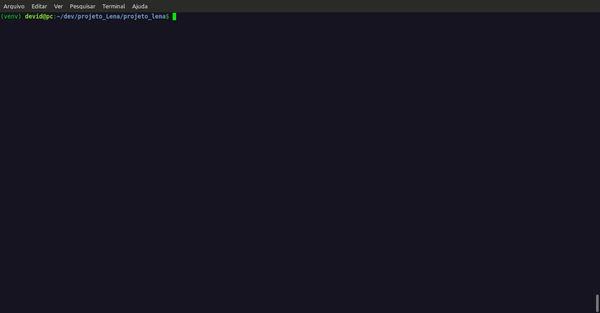

# Projeto Lena
CLI para indicadores financeiros de ativos da B3. 

## Instalação
A ferramenta foi desenvolvida em Python 3.10, portanto atente-se a versão do Python que está rodando na sua máquina. Clone este repo em sua máquina com o Git:

<code>git clone git@github.com:devid8642/projeto_Lena.git</code>

Após entrar no diretório do projeto lembre-se das boas práticas de gerenciamento de ambientes em Python e crie um ambiente virtual para isolar as dependências do projeto. Instale agora as dependências do projeto com o pip:

<code>pip install -r requirements.txt</code>

Ou com o poetry:

<code>poetry install</code>

## Uso
A ferramenta trata-se de uma CLI, portanto é preciso tomar ciência de seus comandos, dos argumentos de cada comando e das opções de cada comando também. Segue abaixo a descrição de tais:

### Comando <i>resumo</i>
Este comando possui como argumento o ticket de um ativo da B3 e ele retorna uma série de indicadores financeiros desse ativo. A sintaxe do ticket é a seguinte: ticket da b3 + .SA. Exemplo com a Petrobrás: PETR4.SA.

